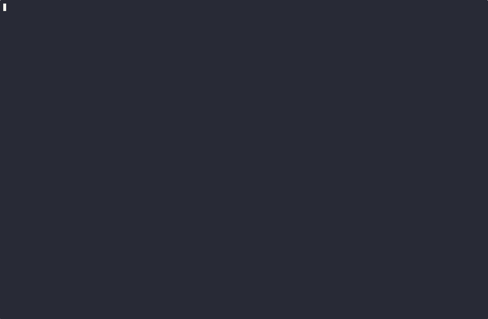
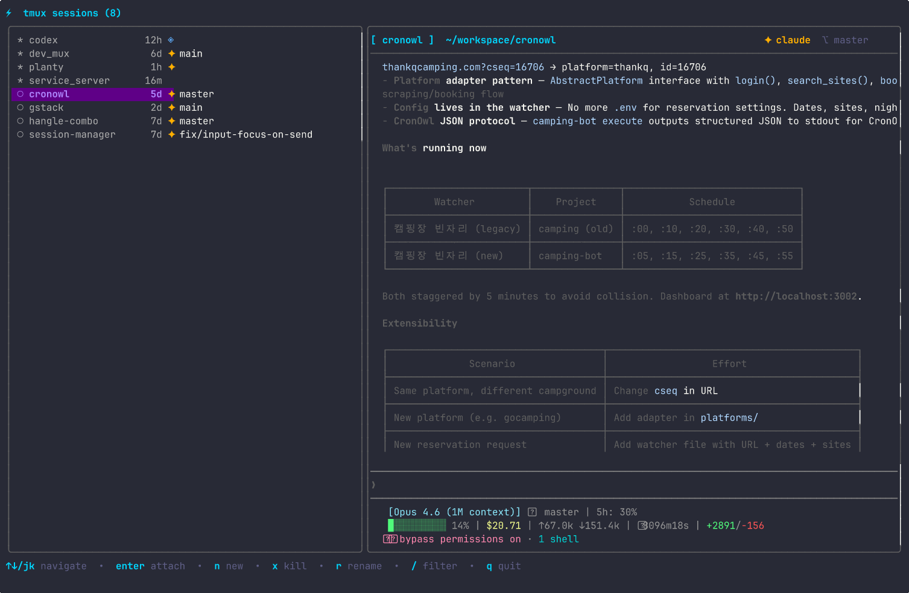
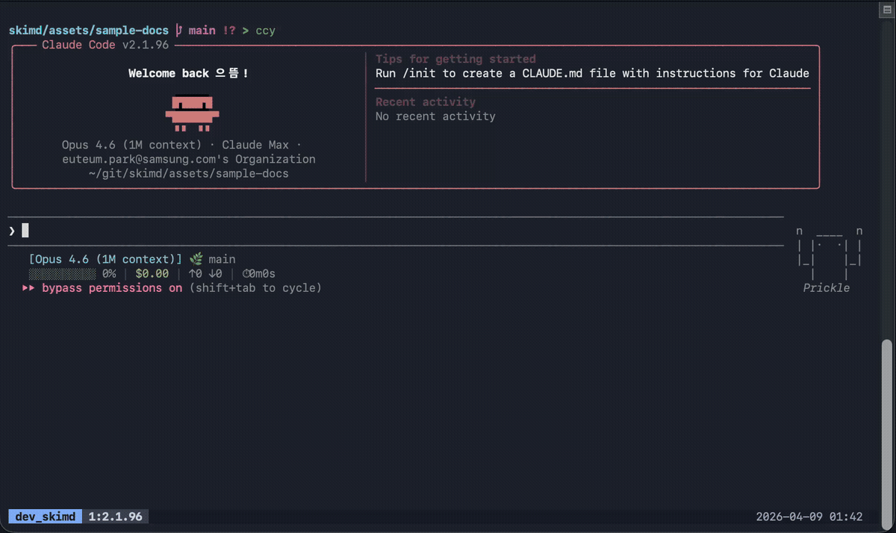

# mux

**AI CLI 세션 간 전환을 빠르고 직관적으로.**

tmux 세션을 터미널에서 빠르게 탐색하고 관리하는 TUI 도구입니다.

[English](README.md)




## 기능

- **실시간 프리뷰** — 선택한 세션의 터미널 출력을 상단 절반에 실시간으로 표시 (500ms 주기 갱신). `Tab`으로 세션을 펼쳐서 윈도우·페인 단위로 각각 프리뷰
- **AI CLI 감지** — `claude`, `codex`, `aider`, `gemini` 등의 AI CLI가 실행 중이면 배지로 표시
- **Git 브랜치 표시** — 각 세션의 현재 브랜치를 표시, worktree는 `⌥⌥`로 구분
- **비용/토큰 추적** — Claude Code 세션의 토큰 사용량과 예상 비용을 실시간 표시 (설정 불필요)
- **상태바 위젯** — `mux status`로 tmux 상태바에 AI 세션 아이콘 표시
- **팝업 오버레이** — AI CLI 실행 중에도 키 하나로 mux를 띄워 세션 전환
- **세션 관리** — TUI 내에서 생성/삭제/이름 변경
- **퀵 필터** — `/` 키로 세션 이름 또는 경로를 실시간 필터링

## 빠른 시작

```bash
# 인터랙티브 설치 (추천)
curl -sSL https://raw.githubusercontent.com/lunemis/mux/main/install.sh | bash

# 또는 직접 설치
brew install lunemis/tap/mux   # or: go install github.com/lunemis/mux/cmd/mux@latest
mux                             # 세션 매니저 실행
```

팝업 모드 설정 (tmux 위에 오버레이로 띄우기):

```bash
mux setup-keybind               # prefix + m을 바인딩하고 리로드 명령 출력
```

출력된 리로드 명령을 실행하세요. 이제 tmux에서 `Ctrl+b` → `m`으로 mux를 열 수 있습니다.

## 설치

### 인터랙티브 설치 (추천)

바이너리 설치와 키바인딩 설정을 안내합니다:

```bash
curl -sSL https://raw.githubusercontent.com/lunemis/mux/main/install.sh | bash
```

### Homebrew

```bash
brew install lunemis/tap/mux
```

### 소스에서 빌드

```bash
git clone https://github.com/lunemis/mux.git
cd mux
make install   # /usr/local/bin에 설치
```

### Go install

```bash
go install github.com/lunemis/mux/cmd/mux@latest
```

## 사용법

### 기본

`mux`를 실행하면 세션 매니저가 열립니다. `j`/`k`로 탐색, `Enter`로 attach, `q`로 종료.



상단 절반에는 선택한 세션의 **실시간 프리뷰**가 500ms마다 갱신됩니다. 테마 색상의 가로 구분선 아래에는 전체 너비의 세션 트리가 표시되고, 하단 두 줄에는 현재 키 도움말이 가운데 정렬되어 표시됩니다.

세션은 OS 창 전환기처럼 동작합니다. tmux 안에서는 직전에 사용한 세션이 맨 위에 표시되고, 나머지는 MRU 순서로 이어지며, mux를 호출한 현재 세션은 맨 아래로 이동합니다. 바로 `Enter`를 누르면 이전 세션으로 전환되고 mux를 다시 열면 되돌아갈 수 있습니다. 백그라운드 출력은 목록 순서를 바꾸지 않습니다. tmux 밖에서는 MRU 우선 순서를 유지합니다. 한 번도 방문하지 않은 세션은 생성 시간(최신 우선), 그다음 이름 순으로 정렬됩니다.

이 전환기 동작 이전에 mux로 만든 팝업 키바인딩은 호출한 원래 세션을 팝업에 전달하도록 한 번 다시 생성해야 합니다. `setup-keybind`가 출력하는 리로드 명령을 실행하세요:

```bash
mux setup-keybind
```

직접 관리하는 팝업 키바인딩은 `mux`를 바로 실행하지 말고 호출한 세션을 전달하여 `mux popup`을 실행해야 합니다. 다음은 전역 `Ctrl+Backspace` 바인딩 예시입니다:

```tmux
bind-key -n C-BSpace run-shell 'MUX_ORIGIN_SESSION=#{q:session_name} "/absolute/path/to/mux" popup'
```

### 테마

mux에는 두 가지 내장 테마가 있습니다:

- `default` — 기존 어두운 터미널 팔레트
- `solarized-gruvbox` — Solarized 대비와 Gruvbox Light Soft 색상을 조합한 밝은 테마

`--theme`으로 테마를 선택할 수 있습니다:

```bash
mux --theme solarized-gruvbox
mux --theme solarized-gruvbox popup
```

`$XDG_CONFIG_HOME/mux/config.json`(`XDG_CONFIG_HOME`이 없으면 `~/.config/mux/config.json`)에 저장하려면:

```json
{
  "theme": "solarized-gruvbox"
}
```

현재 환경에만 적용하려면 `MUX_THEME=solarized-gruvbox`를 설정하세요. 우선순위는 `--theme`, `MUX_THEME`, XDG 설정, `default` 순입니다.

테마 팔레트는 [`theme/*.json`](theme/)에 있으며 바이너리에 내장됩니다. 새 내장 테마를 추가할 때는 기존 파일을 복사해 고유한 `name`, 모든 UI 의미 색상, AI 도구 색상을 지정하세요. 터미널 배경을 유지하려면 `colors.background`를 `"NONE"`으로 설정합니다. 프리뷰 구분선의 `colors.separator`는 패널의 `colors.border`와 독립적입니다.

### 커스텀 키바인딩

모든 mux 동작은 XDG `config.json`에서 키를 변경할 수 있습니다. 설정하지 않은 동작은 기본 키를 유지하고, 설정한 동작의 기본 키는 지정한 키 목록으로 교체됩니다. 각 동작에는 하나 이상의 키를 지정할 수 있습니다.

```json
{
  "theme": "solarized-gruvbox",
  "keybindings": {
    "global": {
      "quit": ["ctrl+q"]
    },
    "list": {
      "up": ["w", "up"],
      "down": ["s", "down"],
      "create": ["c"]
    },
    "create": {
      "submit": ["ctrl+s"],
      "cancel": ["ctrl+x"]
    }
  }
}
```

키 이름은 Bubble Tea 형식을 사용하며 대소문자를 구분합니다. 예: `enter`, `esc`, `tab`, `shift+tab`, `up`, `right`, `ctrl+c` 또는 문자 하나. 알 수 없는 컨텍스트/동작, 빈 키 목록, 같은 모드에서 충돌하는 키는 오류로 처리됩니다. 도움말과 확인 문구에는 현재 설정된 키가 표시됩니다.

| 컨텍스트 | 동작 | 기본 키 |
|---|---|---|
| `global` | `quit` | `ctrl+c` |
| `list` | `up` / `down` | `up`, `k` / `down`, `j` |
| `list` | `first` / `last` | `g` / `G` |
| `list` | `expand` / `collapse` | `tab`, `right`, `l` / `shift+tab`, `left`, `h` |
| `list` | `attach` | `enter` |
| `list` | `create` / `rename` / `kill` | `n` / `r` / `x` |
| `list` | `move_window` | `m` |
| `list` | `filter` / `clear_filter` | `/` / `esc` |
| `list` | `quit` | `q` |
| `create` | `switch_field` | `tab`, `shift+tab` |
| `create` | `submit` / `cancel` | `enter` / `esc` |
| `rename` | `submit` / `cancel` | `enter` / `esc` |
| `filter` | `apply` / `clear` | `enter` / `esc` |
| `kill` | `confirm` / `cancel` | `y`, `Y` / `any` |
| `move` | `up` / `down` | `up`, `k` / `down`, `j` |
| `move` | `confirm` / `cancel` | `enter` / `esc` |

`any`는 `kill.cancel`에서만 사용할 수 있는 기본 폴백입니다. `["n", "esc"]`처럼 명시적인 키로 교체하면 해당 키만 취소에 사용됩니다. 이 설정은 mux TUI 내부 키만 변경합니다. tmux 팝업 키는 `mux setup-keybind`로 별도 설정합니다.

윈도우를 이동하려면 세션을 펼치고 윈도우 행을 선택한 뒤 `m`을 누르세요. 대상 세션을 선택하고 `Enter`로 이동하거나 `Esc`로 취소합니다. 대상 세션의 활성 윈도우는 유지되고 비어 있는 다음 인덱스가 사용됩니다. 세션의 마지막 윈도우도 이동할 수 있으며, 선택 창에는 비게 된 소스 세션이 tmux에서 제거되고 연결된 클라이언트가 분리될 수 있다는 경고가 표시됩니다.

### 팝업 모드 (추천)

tmux 안에서 작업 중일 때, 어떤 프로그램이 실행 중이어도 키 하나로 mux를 오버레이로 띄울 수 있습니다.

```bash
# 키바인딩 설정 (최초 1회)
mux setup-keybind          # prefix + m (기본값)
mux setup-keybind Space    # 다른 키로 변경 가능
```

`setup-keybind`가 출력하는 리로드 명령을 실행하세요. `mux popup`으로 수동 실행도 가능합니다.

> **참고:** tmux 3.2 이상 필요


### 상태바 위젯

TUI를 열지 않고 tmux 상태바에서 AI 세션 아이콘을 표시:

```bash
# ~/.tmux.conf에 추가
set -g status-right '#(mux status)'
```

AI 세션이 활성화되면 `✦ ◈` 같은 아이콘이 상태바에 표시됩니다.

### skimd 연동

마크다운 뷰어 [skimd](https://github.com/lunemis/skimd)와 함께 쓰면 AI가 생성한 문서를 tmux 안에서 바로 검토할 수 있습니다.

- `prefix+m` → **mux** — 세션 전환
- `prefix+v` → **skimd** — 문서 훑기



### 기본 키바인딩

아래 기본 키는 [커스텀 키바인딩](#커스텀-키바인딩) 설정으로 교체할 수 있습니다.

| 키 | 동작 |
|---|---|
| `j` / `k` | 아래로 / 위로 이동 |
| `g` / `G` | 처음 / 마지막으로 이동 |
| `Tab` / `→` / `l` | 세션 → 윈도우 → 페인 펼치기 |
| `Shift+Tab` / `←` / `h` | 한 단계 접기 |
| `Enter` | attach (선택한 윈도우·페인까지 포커스) |
| `n` | 새 세션 생성 |
| `r` | 세션 이름 변경 |
| `x` | 세션 삭제 (확인 후) |
| `m` | 선택한 윈도우를 다른 세션으로 이동 |
| `/` | 세션 필터링 |
| `Esc` | 필터 초기화 / 모드 취소 |
| `q` | 종료 |

## 요구사항

- tmux (팝업 모드는 3.2+)
- Linux 또는 macOS

## 기여

[CONTRIBUTING.md](CONTRIBUTING.md)를 참고하세요.

## 라이선스

[MIT](LICENSE)
